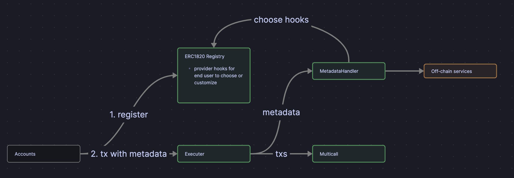

# tx-metadata

## Motivation

Blockchain explorers, such as Etherscan, offer functionality to label addresses. However, when it comes to transactions, these explorers lack the capability for users to add metadata to their transactions.

## Architecture



1. Accounts, both EOA and Smart Contract, should register the hook information into ERC1820 registry.
2. After that, accounts can send transactions to `Executor`. The Executor handle the transactions through `Multicall` contract and handle metadata through `Metadata Handler`.
3. Metadata Handler is an interface of off-chain services, which will triggered by event emission and process metadata.

## Project Structure

**Solidity**

```txt
tx-metadata
├── broadcast
├── contract
├── foundry.toml
├── lib
├── out
├── remappings.txt
├── script
└── test
```

**Frontend**

```txt
tx-metadata
├── index.html
├── package.json
├── pnpm-lock.yaml
├── src
├── tsconfig.json
├── tsconfig.node.json
└── vite.config.ts
```
